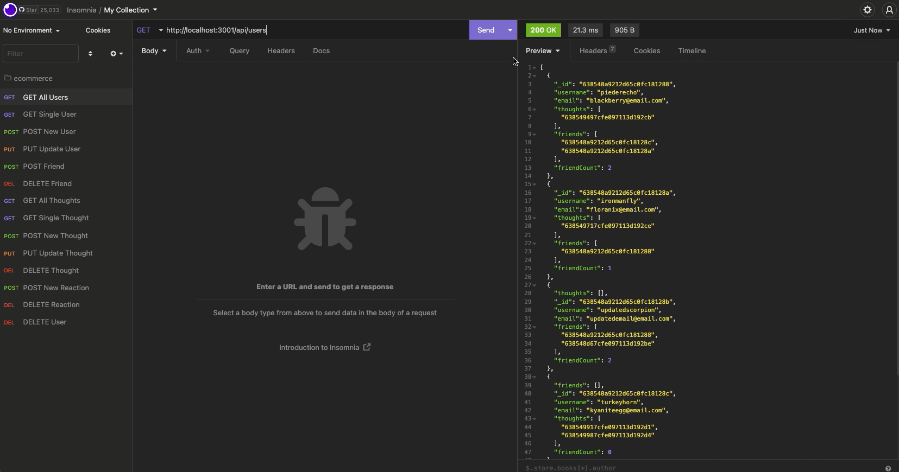

# Social Network API

[Link to Walkthrough Video](https://drive.google.com/file/d/1S7ZlgYqtHqdQ0ui7ANjFuSGTcCVk6vaD/view?usp=share_link)


## Description
The project was built to be able to create an API for a social network web application. When the application is started, Mongoose models are synced to a MongoDB database. There are API GET routes for retrieving all or single user data and all or single thought data in a formatted JSON. There are also API POST routes to create new users or thoughts, PUT routes to update users or thoughts, and DELETE routes to delete users or thoughts. Friends and reactions to thoughts can also be created or deleted through POST and DELETE routes.

## Technologies Used
- JavaScript
- Git
- GitHub
- Express.js
- MongoDB
- Mongoose
- Insomnia

## Usage
Run the following in the command line to start the application's server:
```console
npm start
```

## License
Please refer to the LICENSE in the repo.

## Author Links
[GitHub](https://github.com/ncguan)